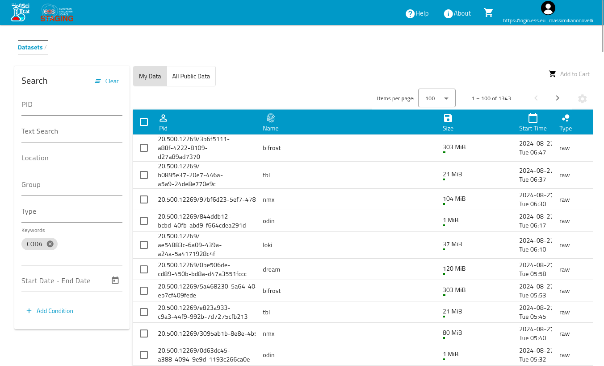

# SciCat

SciCat is the data catalog of choice in ESS.  
It has been developed as an in-kind contribution and through a collaboration between [ESS](https://ess.eu), [PSI](https://www.psi.ch/en), and [MaxIV](https://www.maxiv.lu.se/).  

The current version is _4.x_, and it is based on the following technologies and libraries:
- backend
  - mongodb
  - mongoose
  - typescript
  - node.js
  - nest.js
- frontend
  - node.js
  - angular.js

In order to log in into the ESS instance of SciCat, please visit the url https://staging.scicat.ess.eu, click on the user icon visible in the top right corner of any page.  
You will see the following login screen

Select __Local__ login and type in the credentials that have been provided to you and click __Log in__.  
Once you have successfully logged in, you are directed to the datasets list page.  

This page includes the search form which provides all the functionalities to search and find a specific dataset or a subset of them.  
Once you have found the dataset or datasets that you are interested in, you can view their details page (shown below) by clicking on the matching row.

If you need to use the access token in other applications, you can find it under the _settings_ item of the _main menu_ accessible by clicking on the user icon in the top right corner of the page.
The access token, also called authentication token, is visible under the name __SciCat Token__. As you can see, the UI offers a convenient _copy to clipboard_ functionality.

