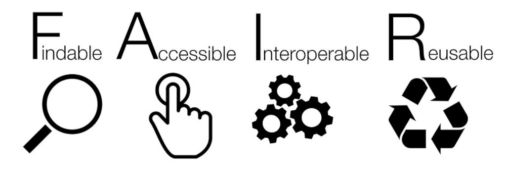
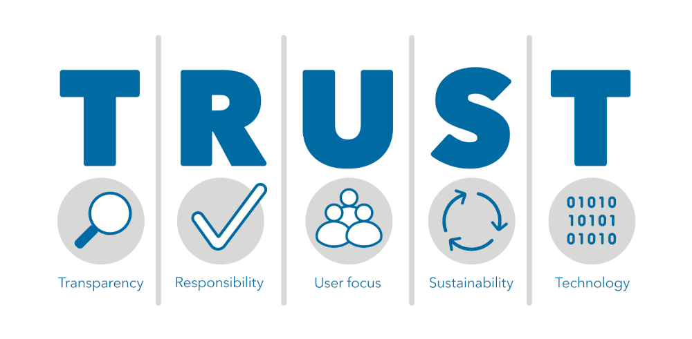

# FAIR Data

One of the goals of __data curation__ is to make the curated data FAIR.  
The FAIR principles were first introduced in 2016 in [The FAIR Guiding Principles for scientific data management and stewardship](https://www.nature.com/articles/sdata201618) paper.

The FAIR principles can be summarized in the following four points:
- Findable
- Accessible
- Interoperable
- Reusable

Further information and the full definition of the FAIR principles can be found on [GO FAIR](https://www.go-fair.org) website, specifically on the [FAIR Principles](https://www.go-fair.org/fair-principles/) page.

The FAIR principles have become very important as they have been embraced by many funding and research institutions, in the effort to enhance the value of the data and to to further increase the re-use of the data.

In 2020, an new and complementary set of principles, named TRUST, have emerged and formalized in [The TRUST Principles for digital repositories](https://www.nature.com/articles/s41597-020-0486-7) paper. 

The TRUST principles are geared more towards the repositories holding the data and are:
- Transparency
- Responsibility
- User Focus
- Sustainability
- Technology

Our experience has tought us that performing data curation correctly and with high quality facilitate to achieve optimal data FAIRness, will also help in having repository TRUSTness, and encourage increasing scientific output.
