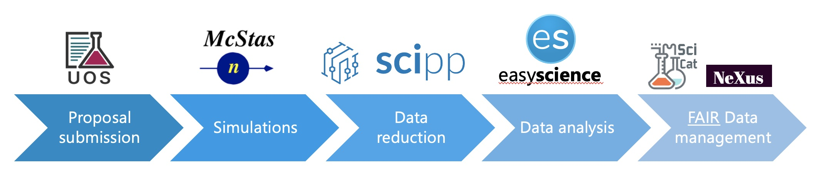

# The First European Spallation Source Data Management and Software Centre Summer School

[Andrew R. McCluskey](https://orcid.org/0000-0003-3381-5911)a,&Dagger;\*, 
Petra Aulina, 
Fredrik Bolmstena, 
Mads Bertelsena, 
[Carina M. C. Lobley](https://orcid.org/0000-0003-3673-2767)b, 
Joanna Lewisb, 
[Massimiliano Novelli](https://orcid.org/0000-0003-2818-0368)a, 
Cosmina Somania, 
Alexandre Stefanova, 
Martin Trajanovskia, 
[Neil Vaytet](https://ocrid.org/0000-0002-6843-0037)a, 
Peter K. Willendrupa, 
[Jan-Lukas Wynen](https://orcid.org/0000-0002-3761-3201)a, 
Sunyoung Yooa, and
[Thomas Holm Rod](https://orcid.org/0000-0002-6227-8062)a\* 

a. Data Management and Scientific Computing Division, European Spallation Source ERIC, Copenhagen, Denmark.
b. European Spallation Source ERIC, P.O. Box 176, SE-221 00, Lund, Sweden.

&Dagger; Current Address: School of Chemistry, University of Bristol, Cantock's Close, Bristol, BS8 1TS, United Kingdom 

* [andrew.mccluskey@bristol.ac.uk](mailto:andrew.mccluskey@bristol.ac.uk)/[thomas.holmrod@ess.eu](mailto:thomas.holmrod@ess.eu)

From the fourth to the eighth of September 2023, the Data Management and Software Centre (DMSC) of the European Spallation Source (ESS) hosted its first Summer School. 
The focus of this school was to introduce "students" (ranging from Master's-level to staff scientists) to the growing importance of data in the neutron scattering landscape. 
The summer school covered aspects of Python programming, experiment simulation, data reduction, analysis, and cataloguing -- with a focus on FAIR (findable, accessible, interoperable, and reusable) data practices throughout.
The school was generously supported by the [Carlsberg Foundation](https://www.carlsbergfondet.dk/en) and the Danish Scattering Association ([DanScatt](https://danscatt.dk/)). 
Students accessed material and JupyterLab through the e-learning course _DMSC Summer School 2023_, which is accessible through the [Photon and Neutron Training portal](https://www.pan-training.eu). 
Alternatively, all the material is freely accessible online at [ess-dmsc-dram.github.io/dmsc-school](https://ess-dmsc-dram.github.io/dmsc-school).
The school was hosted at the Niels Bohr Institute (NBI) of the University of Copenhagen and the DMSC offices in Copenhagen, with a day spent at the ESS site in Lund. 
It was fitting to host the first two days of the school in the historic Auditorium A of the NBI, where Niels Bohr have taught students about neutrons.

The role that data plays in neutron scattering is changing, more impetus is being placed on the use of complex data reduction and analysis [1](https://doi.org/10.1107/S1600576722011426), as well as the importance of FAIR and open data [2](https://doi.org/10.1140/epjp/s13360-023-04189-6).
ESS has recognised this and created the Data Management and Scientific Computing (DMSC) division, based in Copenhagen and linked to the ESS Lund site for fast data transfer. 
This makes ESS unique among neutron scattering facilities, coming online with data as a primary partner in user experiments, alongside the instrumentation itself.

The data from experiments at ESS will be processed by a neutron data pipeline including acquisition, reduction, analysis and cataloguing. 
Therefore, the aim of the DMSC Summer School was to provide an in-depth introduction to these. 
At the summer school the data acquisition step was replaced by simulations such that the students were introduced to the data pipeline illustrated below:

<small>
The data pipeline that students were introduced to at the summer school. The associated software is illustrated above the pipeline.
</small> 

Modern computational practices, in particular the use of the Python programming language and Jupyter Notebooks [3](https://doi.org/10.1109/MCSE.2021.3059263), are required to get the most from neutron scattering data. 
Therefore, the first day of the summer school focused on introducing the Python programming language and the Jupyter Notebook interface. 
This meant that all the students had a firm grounding in Python and were ready to work confidently on the material in later days. 
The first day ended with a presentation introducing FAIR data practices and discussing the role of FAIR in the ESS facility; these concepts would be consolidated throughout the school. Moreover, students were introduced to what encompasses a good proposal for beam time. 

The second day was spent in Lund, first to visit the MAX IV synchrotron source, which is a close neighbour of ESS. 
After a tour of MAX IV, the students were introduced to the neutron instrumentation software McStas [4](https://doi.org/10.1080/10448639908233684), [5](https://doi.org/10.3233/JNR-190108), [6](https://doi.org/10.3233/JNR-200186). 
At this point, the students were asked to select one of two paths for the summer school: small-angle neutron scattering (SANS) or backscattering quasi-elastic neutron scattering (QENS). 
The data that they simulated using McStas would be carried with them throughout the summer school, through reduction, analysis, and storage. 
In the end, the fourteen students split approximately 50:50 between the two neutron scattering techniques.
While at the ESS site, the students were also given a tour of the ESS facilities and participated in a poster session, where they were able to discuss their shared interests around neutron scattering data.

  
<small>
Photographs from the day at the ESS site in Lund, (left) the school students and teachers and (right) the poster session in the ESS attrium.
</small> 

The following day, the students returned to the NBI to continue working with their simulated data. 
The data that they had simulated was equivalent to raw detector data, therefore it was necessary to transform this into something that can be analysed with traditional methods. 
For this, the Scipp package [7](https://doi.org/10.5281/zenodo.8112237) was used, which enables informative visualisations and most importantly the ability to efficiently manipulate and histogram data. 
Using Scipp, the students were able to reduce their McStas data to a one-dimensional dataset of intensity as a function of either wavevector (SANS) or energy transfer (QENS). 
This included concepts of masking data, including normalisations, and processing multiple neutron pulses together. 

With the data reduced, the following day, the students made use of the EasyScience framework [8](https://easyscience.software/), which enables the analysis of experimental data using a model-dependent approach. 
In this context, the SANS data were interpreted with a spherical model, while the QENS analysis made use of a simple Lorentzian function convolved with a Gaussian resolution function. 
Using EasyScience, the students were able to define functional forms for their models and optimise the parameters of interest. 
Beyond standard fitting, the students were introduced to Bayesians methods; Markov chain Monte Carlo and Nested Sampling (using the `emcee` [9](https://doi.org/10.21105/joss.01864) and `dynesty` [10](https://doi.org/10.5281/zenodo.8408702) packages) to investigate the correlations in the model parameters and compare different analytical models, respectively. 

The week ended with continuing the discussion introduced on the first day around the importance of data storage, cataloguing, and FAIR data, in this case using the SciCat [11](https://scicatproject.github.io/) metadata catalogue in use at ESS and multiple other photon and neutron sources. 
In this session, the students were asked to consider what constituted a "dataset" and tasked with using the Scitacean package [12](10.5281/zenodo.8289552) to upload their compiled datasets to the ESS SciCat catalogue.
This allowed students to reconsider, from their conceptions at the start of the week, what data means in terms of neutron scattering, following a week of working closely with data in various different forms.

Alongside the teaching, there was a range of social activities that the students were invited to participate in -- with the aim to build a cohort of data-focused neutron scatterers. 
This started on the Sunday before the school began, with a visit to a board game café in central Copenhagen for the "Welcome Reception".
On the Wednesday evening, the students (and many of the teachers) participated in a programming competition, a game that is regularly played between staff of the DMSC, where they were tasked with writing a Python program, an "AI", to compete in a Battle Royale style tournament, with one "AI" named as the winner. 
Finally, there was a summer school dinner on the Thursday evening, which took place within the Tivoli Gardens in central Copenhagen. 

All in all, the first DMSC Summer School was successful in its aim to introduce members of the neutron scattering community to the growing importance of data in the field. 
The feedback from the participants has been extremely positive and given that the event itself was 300 % oversubscribed, there is ambition to run it again in the future. 
Hopefully, we will be able to welcome you to Copenhagen in the future for another DMSC Summer School. 
