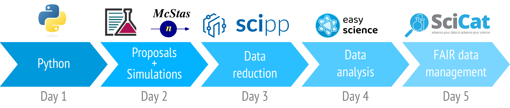

:::{image} images/logo.png
:class: only-light
:alt: DMSC Summer School
:width: 100%
:align: center
:::

:::{image} images/logo.png
:class: only-dark
:alt: DMSC Summer School
:width: 100%
:align: center
:::

```{raw} html
   <style>
    .transparent {display: none; visibility: hidden;}
    .transparent + a.headerlink {display: none; visibility: hidden;}
   </style>
```

```{role} transparent
```

# {transparent}`DMSC School`

<div style="font-size:1.2em;font-style:italic;color:var(--pst-color-text-muted);text-align:center;">
  From proposal to publication
  </br></br>
</div>

The purpose of this online book is as a companion to the workshop materials from the ESS Data Management and Scientific Computing centre Summer School.
This material can be treated in a self-guided fashion.

## Welcome

The aim of the summer school is to cover *in-silico* some the ESS data pipeline.


<!-- Rendered from resources/pipeline-diagram.tex -->

In particular, we will introduce the importance of considering the data that you will collect at a neutron scattering experiment during the proposal stage and the benefits of FAIR data practices.
We will then go on to show how the McStas simulation software can be used to plan the experiment that you will conduct, giving *realistic* simulated data.
This "raw" data will be reduced with the Scipp package, a Python library designed to facilitate the manipulation of scientific data.
Then, the EasyScience framework will be used to analyse our reduced data, where we will be able to draw interesting scientific conclusions.
Finally, all the data will be stored together within the SciCat metadata catalogue -- enabling FAIR storage.

| Contributors |  |  |  |  |
| - | - | - | - | - |
| [Mads Bertelsen](https://github.com/mads-bertelsen) | [Simon Heybrock](https://github.com/SimonHeybrock) | [Henrik Jacobsen](https://github.com/henrikjacobsenfys) | [Johannes Kasimir](https://github.com/jokasimr) | [Andrew R. McCluskey](https://mccluskey.scot) |
| [Massimiliano Novelli](https://github.com/nitrosx) | [Piotr Rozyczko](https://github.com/rozyczko) | [Andrew Sazonov](https://github.com/AndrewSazonov) | [Mridul Seth](https://github.com/MridulS) | [Neil Vaytet](https://github.com/nvaytet) |
| [Christian Vedel](https://github.com/damskii9992) | [Peter Willendrup](https://github.com/willend) | [Jan-Lukas Wynen](https://github.com/jl-wynen) | [Sunyoung Yoo](https://github.com/YooSunYoung) |  |


```{toctree}
---
hidden:
---

3-mcstas/index
```


<!-- ```{toctree}
---
hidden:
---

1-python/index
2-proposals/index
3-mcstas/index
4-reduction/index
5-analysis/index
6-scicat/index
``` -->